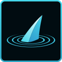
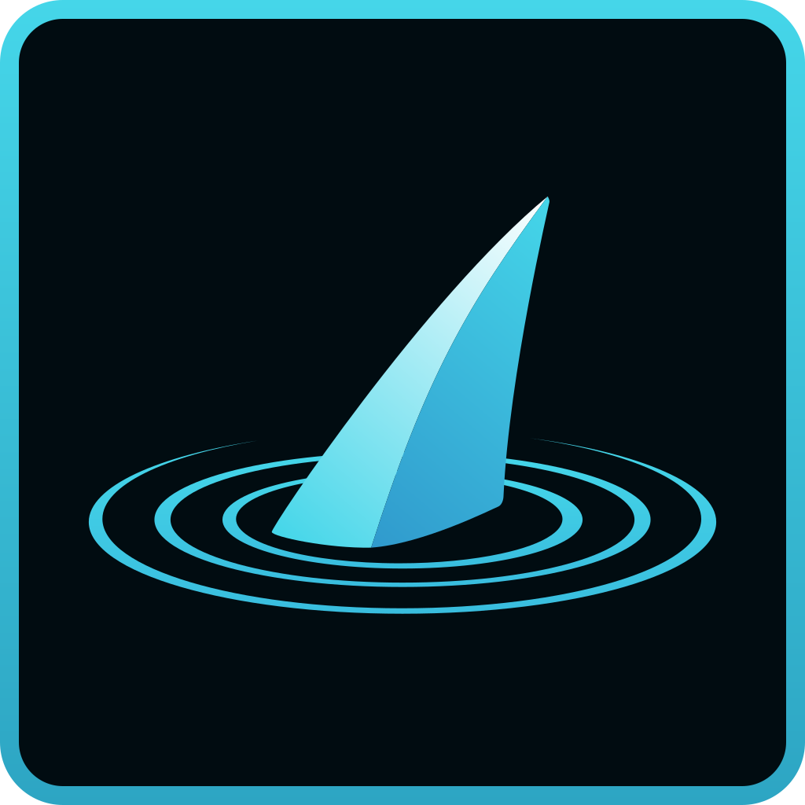

# Icon Usage Guide

All icons are generated from the SVG sources in `/svg/`. Two variants are used depending on context:

- **Favicon.svg** — simplified mark (fin + single ring) for small sizes where detail is lost
- **Logo.svg** — full mark (fin + sonar rings, transparent background) for larger web use
- **App Icon.svg** — full mark on dark rounded-rect background with cyan border, for app stores and desktop

---

## Favicons (Web)

Use the simplified mark for browser tabs and bookmarks.

### favicon.svg


The SVG favicon for modern browsers. Link it as the primary favicon:

```html
<link rel="icon" type="image/svg+xml" href="/favicon.svg">
```

### favicon.ico

Multi-size ICO (16, 32, 48px) for legacy browser support:

```html
<link rel="icon" type="image/x-icon" href="/favicon.ico">
```

### favicon-16x16.png


```html
<link rel="icon" type="image/png" sizes="16x16" href="/favicon-16x16.png">
```

### favicon-32x32.png


```html
<link rel="icon" type="image/png" sizes="32x32" href="/favicon-32x32.png">
```

### favicon-48x48.png


Used inside `favicon.ico` and for Android Chrome shortcuts.

---

## App Icons (Desktop & Mobile)

Use the branded dark-background variant for any context where the icon appears standalone — app stores, taskbars, home screens, installers.

### apple-touch-icon.png (180x180)


For iOS home screen. Place at the web root or link explicitly:

```html
<link rel="apple-touch-icon" href="/apple-touch-icon.png">
```

### icon-64x64.png


Windows taskbar (2x DPI), Linux panel icons.

### icon-128x128.png



macOS Dock (standard), Electron/Tauri default icon.

### icon-256x256.png


Windows large icon view, macOS Dock (Retina).

### icon-512x512.png


Google Play Store, macOS Dock (Retina HiDPI).

### icon-1024x1024.png



Apple App Store, marketing assets.

### app-icon.ico

Multi-size Windows ICO (16–256px) for desktop applications. Use as the application icon in Electron, Tauri, or native Windows builds:

```json
{
  "build": {
    "win": {
      "icon": "assets/icons/app-icon.ico"
    }
  }
}
```

---

## Web Manifest Example

```json
{
  "icons": [
    { "src": "/favicon-16x16.png", "sizes": "16x16", "type": "image/png" },
    { "src": "/favicon-32x32.png", "sizes": "32x32", "type": "image/png" },
    { "src": "/favicon-48x48.png", "sizes": "48x48", "type": "image/png" },
    { "src": "/icon-128x128.png", "sizes": "128x128", "type": "image/png" },
    { "src": "/icon-256x256.png", "sizes": "256x256", "type": "image/png" },
    { "src": "/icon-512x512.png", "sizes": "512x512", "type": "image/png" }
  ]
}
```

---

## HTML Head Example

```html
<link rel="icon" type="image/svg+xml" href="/favicon.svg">
<link rel="icon" type="image/x-icon" href="/favicon.ico">
<link rel="icon" type="image/png" sizes="16x16" href="/favicon-16x16.png">
<link rel="icon" type="image/png" sizes="32x32" href="/favicon-32x32.png">
<link rel="apple-touch-icon" href="/apple-touch-icon.png">
<link rel="manifest" href="/site.webmanifest">
```
